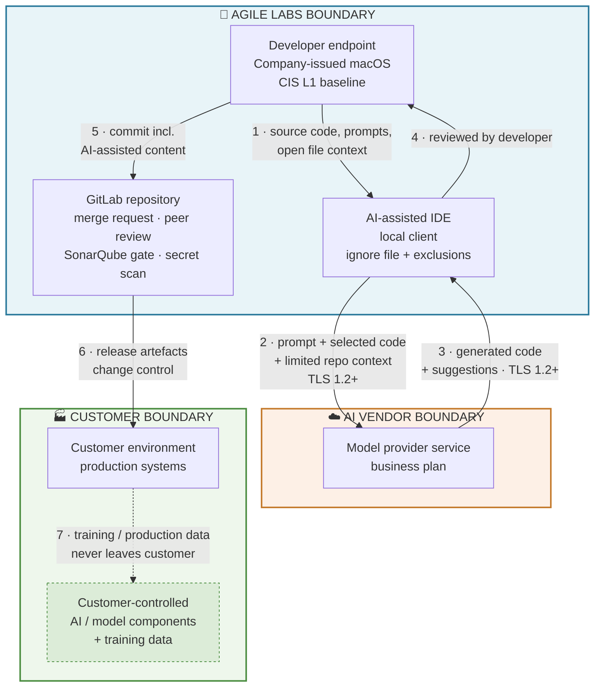

# AI Data Flow — Diagram and Step Narrative

**AGILE LABS PTE. LTD.** · Rev 1.0 · 14 August 2026 · Owner: ISM · Classification: Internal

> **Evidence for CTM 2025 clause B.9.6** — *"Data flow diagram for AI assets have not been established, e.g. training data, data input including prompts, data output from AI."*
>
> The finding named three things explicitly. All three are addressed below: **training data** (Section 3, steps 6–7 — outside Company custody), **data input including prompts** (steps 1–2), and **data output from AI** (steps 3–5).

---

## 1. Diagram

**Reading the diagram**

- **Solid arrows** = data actually flows.
- **Dashed arrows** = flows and components outside Agile Labs custody. They occur, but under the customer's governance, not ours.
- The three coloured boxes are the three trust boundaries.

## 2. Step narrative

| Step | From | To | Data transferred | Classification | Protocol / channel | Control applied | Boundary crossed |
|---|---|---|---|---|---|---|---|
| **1** | Developer endpoint (Company-issued Mac) | AI-assisted IDE (local client) | Source code, prompts, open file context | Confidential | Local | Ignore file and workspace exclusions prevent secrets and restricted paths entering context (ISMS-25 Section 4) | None — inside Agile Labs |
| **2** | AI-assisted IDE (local client) | Model provider service | Prompt, selected code, limited repository context | Confidential | HTTPS / TLS 1.2+ |training on Company data disabled; minimum retention; | **Agile Labs → vendor** |
| **3** | Model provider service | AI-assisted IDE | Generated code and suggestions | Confidential (inherited, ISMS-27 Section 2.3) | HTTPS / TLS 1.2+ | Output treated as suggestion and as untrusted data; never executed unreviewed | **Vendor → Agile Labs** |
| **4** | AI-assisted IDE | Developer | Generated code presented for review | Confidential | Local | Developer must be able to explain the code before use. | None |
| **5** | Developer endpoint | GitLab repository | Committed code including AI-assisted content | Confidential | SSH / HTTPS | Peer review in merge request. | None — inside Agile Labs |
| **6** | GitLab repository | Customer environment | Application release artefacts | Per contract | Customer deployment process | Change management; customer-side approval; responsibilities confirmed in writing | **Agile Labs → customer** |
| **7** | Customer environment | Customer-controlled AI / model components | Customer training data and production data | Customer confidential | Within customer environment | **Outside Agile Labs custody.** Responsibilities recorded in the contract. No Company AI tool is granted access. | Inside customer only |
| **8** | Endpoint web traffic | Unsanctioned GenAI services | **Blocked** | n/a | HTTPS | Block unapproved GenAI URLs | **Blocked at the Agile Labs boundary** |

## 3. Training data — explicit position

| Question | Position | Basis |
|---|---|---|
| Does Agile Labs train or fine-tune models? | **No.** | AIMS-00 Section 2.2 |
| Does Agile Labs purchase training data? | **No.** | AIMS-00 Section 2.2 |
| Where a customer trains or fine-tunes, who holds the data? | **The customer.** Training data, training environment and production environment remain under customer control. | AIMS-00 Section 2.4 |
| Does Company content become training data for the AI vendor? | **No** — training on Company and customer content is disabled on the business plan and evidenced quarterly. | ISMS-25 Section 4, AI Asset Register |

## 4. Data at rest, in transit, in use

| State | Where AI data is in this state | Protection |
|---|---|---|
| **In transit** | Steps 2, 3, 5, 6 | TLS 1.2+ |
| **At rest** | GitLab repository; vendor context index; endpoint disk; evidence folder | AES-256; full-disk encryption on endpoints; vendor retention minimised |
| **In use** | Developer endpoint memory; model provider inference | Endpoint hardening and screen lock. |

