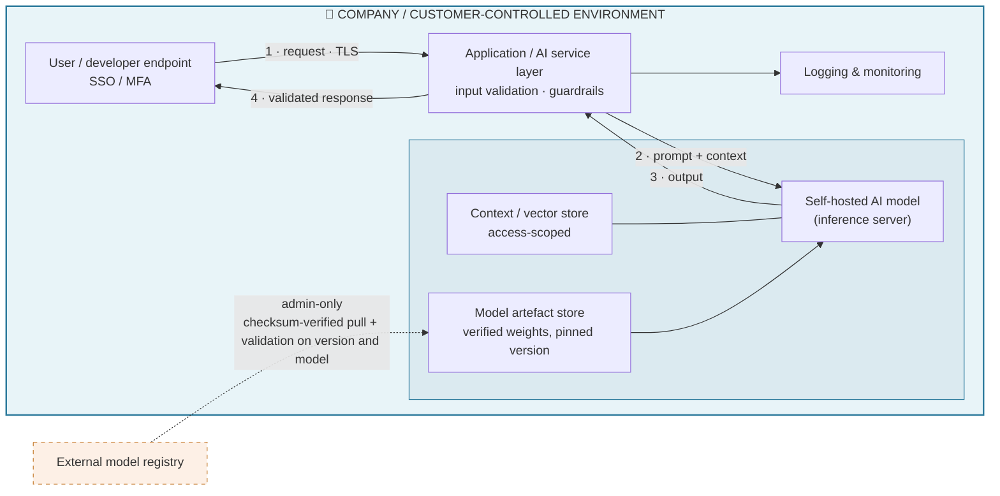
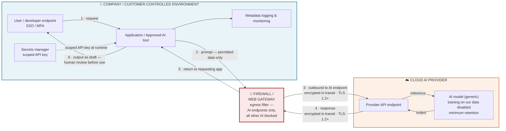

# AI Deployment — Network Diagrams

**AGILE LABS PTE. LTD.** — ISMS-27 AI Data Governance and Handling Standard

| | | | |
|---|---|---|---|
| **Document number** | ISMS-27 Annex B | **Revision** | 1.0 |
| **Document owner** | Technical Leader | **Issue date** | 14 August 2026 |
| **Classification** | Internal | **Next review** | Annually, or on material change to AI use |
| **Approval chain** | Prepared: Technical Leader · Reviewed: ISM · Approved: Director |  | |

---

## Revision history

| Rev | Date | Prepared by | Change |
|---|---|---|---|
| 1.0 | 14 August 2026 | Technical Leader | New annex to ISMS-27. Generic network diagrams for the two AI deployment patterns: internal self-hosted model and external cloud-provider model. |

## Approval

| Role | Name | Date |
|---|---|---|
| Prepared by — Technical Leader | Wayne Tng | 14 August 2026 |
| Reviewed by — Information Security Manager | Sze Tho ChangSheng | 14 August 2026 |
| Approved by — Director | Liao Zhuli, Sujata | 14 August 2026 |

## 1. Purpose

These diagrams show how an AI model interacts with Company systems under the two deployment patterns the Company uses or may deliver. The model is generic — the patterns apply regardless of which model or vendor is behind them.

---

## 2. Pattern 1 — Internal (self-hosted AI model)

The model runs inside the Company or customer-controlled environment. Prompts, context and outputs never leave the boundary; the only external traffic is the controlled, admin-only download of model artefacts.

**Key properties**

| Property | Position |
|---|---|
| Trust boundary | Everything at inference time stays inside the controlled environment |
| Model integrity | Weights verified and version-pinned before use |
| Data at rest | Prompts/outputs logged per environment rules; context store access-scoped to the requesting user |
| Segmentation | AI components in their own segment; connectivity to other corporate systems restricted by data sensitivity classification or firewall |

## 3. Pattern 2 — External (AI model via cloud provider)

The model runs in the provider's cloud. Prompts and context cross the Company boundary over TLS; provider-side handling is bounded by contract and configuration.

**Reading the diagram.** The firewall/web gateway sits on the Company boundary — every AI request and response passes through it in both directions.

Outbound (step 3) it permits connections to AI provider endpoints only.

**TLS 1.2+** on steps 3 and 4 means the traffic crossing the boundary is encrypted in transit using Transport Layer Security version 1.2 or above.

Steps 1, 2, 5 and 6 stay inside the controlled environment; the inference hop stays inside the provider's environment.

**Key properties**

| Property | Position |
|---|---|
| Trust boundary | Prompts and context cross to the provider; only data permitted by classification may cross (no customer data, personal data or secrets) |
| Egress control (outbound) | Web gateway/filter permits AI endpoints only. |
| Provider-side handling | Training on Company content disabled retention minimised. |
| Credentials | API keys scoped and held in the secrets, never in prompts or code |
| Output handling | Treated as a draft — human review before use |
| Logging | Metadata logged Company-side; content per environment rules |

## 4. Pattern comparison

| | Internal (self-hosted) | External (cloud provider) |
|---|---|---|
| Where the model runs | Inside the controlled environment | Provider cloud |
| Do prompts leave the boundary? | No | Yes — permitted data classes only, TLS 1.2+ |
| Primary risk | Model/artefact integrity, internal access control | Data leakage, vendor handling, availability |
| Primary controls | Segmentation, verified artefacts | Permitted-data table, egress filter, no-training terms, due diligence |
